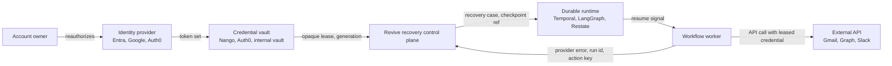
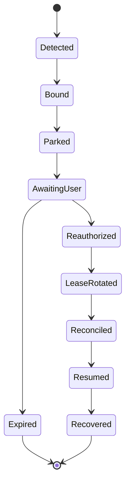

# Revive trust-boundary architecture

This document states what Revive owns, what it deliberately does not own, and which controls are required before accepting customer credentials in a hosted deployment.

## Scope

Revive is a recovery control plane for durable agent and workflow runs. It correlates a credential failure to the affected logical run, opens a recovery case, verifies the correct account during reauthorization, rotates an opaque credential lease and resumes the original checkpoint with the original idempotency key.

Revive is not intended to replace a customer's identity provider, token vault or workflow runtime.

## Trust boundaries

### Boundary 1: Identity provider

The identity provider authenticates the user and issues tokens. Revive validates the OAuth callback state and account subject, but the provider remains the source of identity truth.

Controls:

- Authorization Code + PKCE for browser reauthorization.
- Constant-time OAuth state comparison.
- Short-lived encrypted OAuth transaction cookie.
- Exact redirect URI registration in the owned tenant.
- Subject match against the original recovery ticket before accepting the new connection.

Current implementation reference:

- `lib/oauth/entra.ts`
- `app/api/oauth/entra/start/route.ts`
- `app/api/oauth/entra/callback/route.ts`

### Boundary 2: Credential vault

Revive should not require ownership of the customer's token vault. The hosted product can integrate with Nango, Auth0 Token Vault or an internal vault.

Preferred production model:

- The vault stores raw refresh tokens.
- Revive stores recovery metadata, token fingerprints and opaque lease references.
- Workers receive only short-lived access material through the customer's approved credential path.
- Workflow history never stores raw refresh tokens.

Current repository note:

- The demo can persist encrypted token sets for local and staging paths.
- Production SaaS should prefer external vault custody or managed secret storage with KMS rotation.

Current implementation reference:

- `lib/hosted.ts`
- `lib/integrations/nango.ts`
- `lib/integrations/auth0-token-vault.ts`
- `lib/secure-envelope.ts`

### Boundary 3: Revive recovery state

Revive owns the recovery contract:

- recovery case
- credential lease generation
- checkpoint reference
- provider signal
- reauthorization ticket
- side-effect ledger
- replay and reconciliation evidence

Revive should store enough state to prove safe recovery, but not enough to become the system of record for customer business data.

Required controls:

- Tenant isolation on every recovery case, connection and job.
- RBAC for opening, viewing and closing recovery cases.
- Append-only audit events for reauthorization, lease rotation, webhook delivery and resume.
- Recovery link TTL with single-use consumption.
- Idempotency keys on mutating actions.
- Generation fencing so stale workers cannot continue with rejected credentials.

Current implementation reference:

- `lib/engine.ts`
- `lib/store.ts`
- `db/migrations/0001_control_plane.sql`
- `sidecar/revive/engine.py`
- `sidecar/revive/checkpoint.py`

### Boundary 4: Durable runtime

Temporal, LangGraph, Restate and similar runtimes own durable execution. Revive should not replace their schedulers or event histories.

Revive sends runtime-native signals:

- LangGraph: interrupt payload and resume command.
- Temporal: workflow signal with recovery case ID, connection ID and lease generation.
- Sidecar: durable checkpoint and rendezvous record.

Raw refresh tokens must not enter workflow history.

Current implementation reference:

- `sidecar/revive/adapters/langgraph.py`
- `sidecar/revive/adapters/temporal.py`

### Boundary 5: External APIs and side effects

Revive cannot assume whether a remote side effect committed when a provider fails mid-call. Mutating actions need an action ledger and, where possible, a reconcile callback.

Controls:

- Stable idempotency key per logical action.
- Action state: prepared, committed, reconciled.
- Stop on ambiguous commit if no reconcile callback exists.
- Resume with the original action key after reauthorization.

Current implementation reference:

- `sidecar/revive/engine.py`
- `sdk/typescript/src/index.ts`

## Token custody model

Recommended production stance:

1. Revive does not become the primary token vault.
2. Revive can store encrypted staging credentials for local development and controlled demos.
3. Production deployments use Nango, Auth0 Token Vault, provider-managed storage or a customer-controlled secret manager.
4. Revive stores token fingerprints, scopes, provider subject, connection ID and lease generation.
5. Revive webhooks and runtime signals carry opaque identifiers, not raw refresh tokens.

## Recovery state machine

State requirements:

- `Detected`: provider signal is classified.
- `Bound`: run, lease, checkpoint and action key are correlated.
- `Parked`: the original run is durably stopped.
- `AwaitingUser`: a one-time recovery capability is open.
- `Reauthorized`: OAuth subject and scopes are verified.
- `LeaseRotated`: credential generation advances.
- `Reconciled`: mutating action safety is checked.
- `Resumed`: runtime-native resume signal is delivered.
- `Recovered`: the original logical run completes or continues.

## Threat model

| Threat | Control |
|---|---|
| Wrong user reauthorizes | OAuth subject match against original ticket |
| Stale worker continues | Credential lease generation fencing |
| Leaked recovery URL | 256-bit random ticket, short TTL, single-use consumption |
| Duplicate side effect | Idempotency key plus action ledger and reconcile callback |
| Tenant crossover | Tenant-scoped primary keys, row policies and authorization checks |
| Webhook spoofing | Timestamped HMAC signatures and replay tolerance |
| Queue loss | Durable Postgres jobs with retry, backoff and dead state |
| Token leakage in workflow history | Opaque lease IDs in runtime signals |
| Revive unavailable | Runtime keeps the run parked and recovery can retry when Revive returns |

## Data retention

Default hosted policy should be:

- Recovery case metadata: retained for the customer audit window.
- Token fingerprints and provider subjects: retained while the connection exists, then removed or anonymized.
- Raw token sets: not retained by Revive in the preferred production model.
- Webhook bodies: retained only while pending or failed, then summarized.
- Audit events: retained according to the customer's compliance tier.

## Deployment options

### SaaS

Best for teams that want Revive to operate recovery routing, hosted dashboard, queue workers and webhooks.

Required before GA:

- managed KMS
- managed Postgres backups
- tenant isolation
- RBAC
- audit logs
- external security review
- production queue workers

### VPC or private cloud

Best for customers with strict credential and audit boundaries. Revive runs in the customer's network and integrates with their vault and runtime.

Required:

- customer-managed database
- customer-managed KMS or secret manager
- private runtime callbacks
- deployment runbook

### Self-hosted

Best for early adopters and security-sensitive design partners. Lower Revive operational burden, higher customer setup burden.

Required:

- Docker image
- migration scripts
- sample Temporal and LangGraph deployments
- health checks
- webhook signing secret rotation docs

## Open production gates

These are not optional for a hosted credential service:

1. Tenant isolation across every hosted table and API route.
2. Managed KMS and secret-manager deployment.
3. Key rotation and envelope versioning.
4. Audit identity for every recovery action.
5. RBAC for recovery operators and viewers.
6. Continuously operated queue workers with dead-letter review.
7. Managed Postgres backups and recovery drills.
8. External penetration test or security architecture review.
9. Data retention controls and deletion workflow.
10. Design partner staging tenants for Entra, Nango and Auth0.

## Current status

Implemented in this repository:

- local recovery engine
- Python sidecar
- LangGraph and Temporal adapters
- Entra Authorization Code + PKCE path
- encrypted local or Postgres credential records
- signed webhook delivery
- durable Postgres queue primitives
- executable ReviveBench local evidence runner
- provider subject and tenant binding before recovery consumption
- SQLite and Postgres credential-generation fencing
- TypeScript SDK package surface

Not yet proven:

- managed hosted tenant isolation
- continuous worker operations
- live customer credential handling
- third-party security assessment
- customer recovery metrics
- compliance program

## Security review questions

Before a production pilot, answer these for each customer:

1. Which system is the token vault?
2. Does Revive ever receive raw refresh tokens?
3. Which principal is allowed to approve recovery?
4. How is OAuth subject equality checked?
5. Where are recovery tickets stored?
6. How long do recovery tickets live?
7. What happens if the workflow runtime is down?
8. What happens if Revive is down?
9. How are duplicate side effects reconciled?
10. Who can read recovery case evidence?
11. How are webhook failures retried?
12. How are audit records exported?
